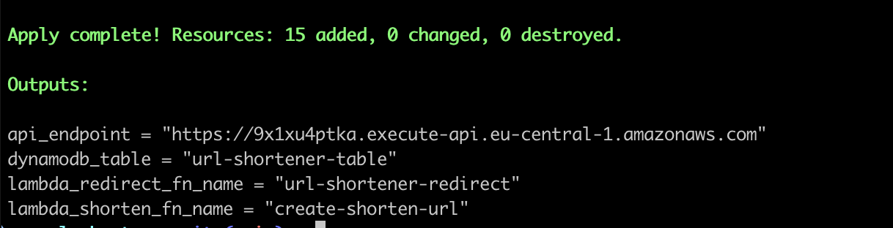
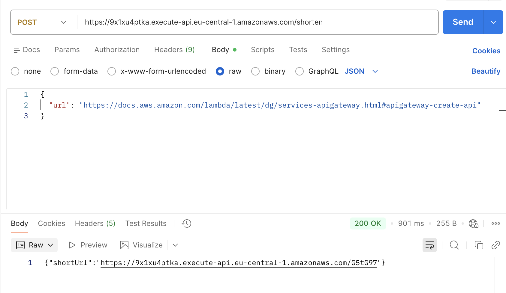

# URL Shortener Service (AWS Serverless / Terraform / Typescript)

A serverless URL shortening backend with AWS that can be deployed end-to-end using Terraform in minutes.

## Tech Stack
- **TypeScript**
- **AWS Lambda**
- **API Gateway**
- **DynamoDB**
- **Terraform (IaC)**

## Features
- Shorten long URLs to short unique codes
- Automatic redirection using `GET /{code}`
- Infrastructure as Code with **Terraform**
- Fully serverless, highly scalable & low-cost
- Built with **Node.js + TypeScript**

## Prerequisite
- Nodejs
- NPM
- Terraform
- AWS account
- AWS CLI **and credentials configured**


> Terraform requires valid AWS credentials.  
> Run `aws configure` or export environment variables before running any Terraform commands.

## Installation & Deployment 
Clone the repo
> git clone https://github.com/leconghieu/url-shortener.git

Install dependencies and and init infra
> npm install

Build and zip lambda functions
> npm run build

Deploy
> npm run tf:deploy

## How to test
> 💡 If you don’t want to deploy the infrastructure, you can test using the example `api_endpoint` below.

After successfully running `npm tf:apply`, the api endpoint would be shown as below:


Then you can use Postman to send a POST request like this to the endpoint `https://<api_key>.execute-api.eu-central-1.amazonaws.com/shorten`.

Example 
```bash
POST /shorten HTTP/1.1
Content-Type: application/json

{
  "url": "https://example.com/very/long/url"
}
```
→ Response:
```bash
{
  "short_url": "https://<api>.execute-api.eu-central-1.amazonaws.com/abc123"
}
```



You can now access the `short_url`, It will automatically redirect to the real `url` you created above.

API endpoint(for testing): https://9x1xu4ptka.execute-api.eu-central-1.amazonaws.com/shorten

## To Improve
- Use shorter custom domain instead of the long API Gateway endpoint.
- Add unit tests.
- Add ESLint + Prettier CI checks before deployment.
- Add rate limiting and security enhancements.